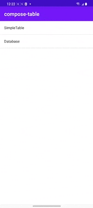

## Readme

Compose-table is a funny compose project to display multiple rows and columns. You can scroll in any direction (
vertically and horizontally)

Since the official compose didn't support scroll in any directions. We can use this model to display all kinds of data.

## Table of content

- [How to use](#how-to-use)
    - [Initial demo table](#Initial demo table)
    - [Initial data with database.](#Initial data with database.)
- [Samples](#samples)

### how-to-use

#### Initial demo table

<details>
<summary>demo</summary>

```
SimpleTable(
        modifier = Modifier
    ) {
        val list = (0 until 200).map { "$it" }.toList()
        val header = (0 until 10).map { "Header:$it" }.toList()
        header(header) { item, column ->
            Text(
                text = item,
                modifier = Modifier
                    .background(color = Color.Gray)
                    .padding(16.dp),
                color = Color.Black,
                fontSize = 24.sp
            )
        }
        items(list) { item, row, column ->
            Text(
                "Item[$row:$column]",
                modifier = Modifier.padding(12.dp),
                fontSize = 16.sp
            )
        }
    }
```

<details>

#### Initial data with database.

<details>
<summary>database</summary>

```

@Composable
fun DatabaseTable(cursor: Cursor?) {
    if (null == cursor) return
    var selectedRow by remember {
        mutableStateOf(-1)
    }
    SimpleTable<String>{
        header(cursor.columnNames.toList()) { item, _ ->
            Text(
                text = item,
                modifier = Modifier
                    .background(color = Color.White)
                    .padding(start = 16.dp, top = 4.dp, end = 16.dp, bottom = 4.dp),
                color = Color.Black,
                fontSize = 24.sp
            )
        }
        items(cursor.count) { row, column ->
            cursor.moveToPosition(row)
            val item = cursor.getString(column)
            Box(
                modifier = Modifier
                    .pointerInput(Unit) {
                        detectTapGestures(
                            onTap = {
                                selectedRow = row
                            }
                        )
                    }
                    .background(
                        if (selectedRow == row) Color.Cyan else
                            if (0 == row % 2) Color.White else Color.LightGray
                    )
                    .border(width = 0.5.dp, color = Color.Gray)
                    .padding(top = 8.dp, bottom = 8.dp)
                    .fillMaxWidth(),
                contentAlignment = Alignment.Center
            ) {
                Text(
                    text = item,
                    maxLines = 1,
                    overflow = TextOverflow.Ellipsis,
                    modifier = Modifier.align(Alignment.CenterStart),
                    fontSize = 16.sp
                )
            }
        }
    }
}
```

</details>

#### Samples

* [demo-apk](apk/app-debug.apk)

* 